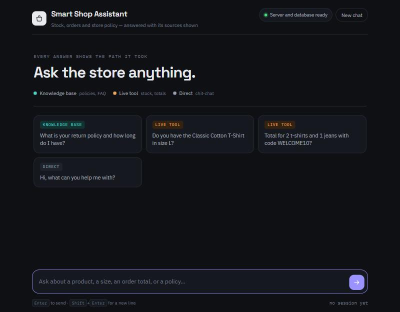
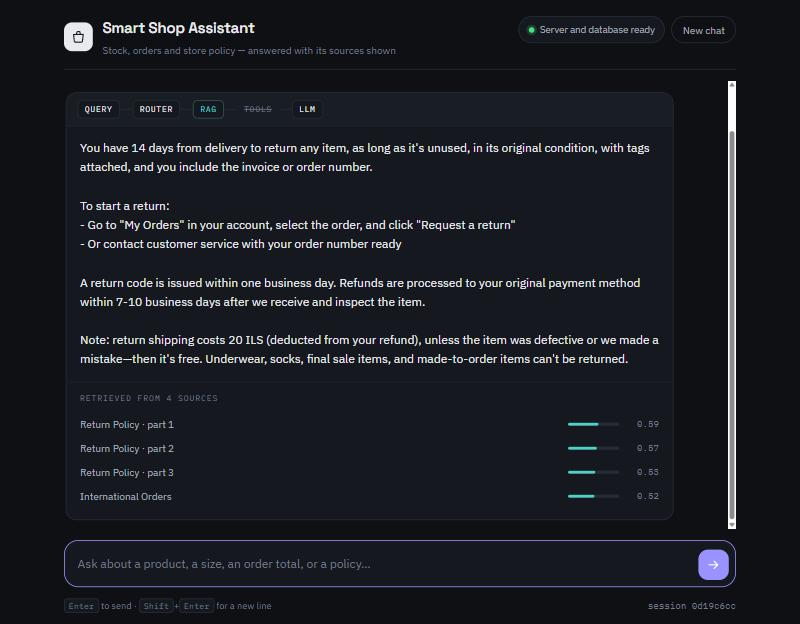

# Smart Shop Assistant

An agentic assistant for a small online clothing shop: it answers policy questions from a
knowledge base, checks live stock, and prices an order with a discount code — routing every
question to the path that fits it.

**Mohammed**



A question answered from the knowledge base, with the route it took and the retrieved
sources and their similarity scores:



## Overview

Smart Shop Assistant is a chat assistant for a small online clothing shop. A customer
can ask about shop policies (returns, exchanges, delivery, payment, warranty), check
whether a specific product is in stock in a specific size, or get an order total
calculated with a discount code.

Every request follows the same pipeline:

```
USER QUERY → AGENT ROUTER → RAG / TOOLS → LLM → RESPONSE
```

The Agent Router runs on **every** request. The LLM is never called directly without it.
The interface makes this visible: each answer carries a trace rail showing which path
it actually took, the retrieved sources with their similarity scores, and the exact
tool call when a tool was used.

## Architecture

| Tier | Technology | Location |
|---|---|---|
| Client | Plain HTML + CSS + JavaScript (no framework) | `client/` |
| Server | Flask (owns all AI logic and all secrets) | `server/` |
| Database | PostgreSQL 16 + pgvector, in Docker | `docker-compose.yml`, `server/db/schema.sql` |

Server components: **Agent Router** (`services/router.py`), **RAG module**
(`services/rag.py`), **Tools module** (`services/tools.py`), **LLM module with
LangChain LCEL** (`services/llm_chain.py`), **Response formatter**
(`services/formatter.py`).

See [`docs/architecture-diagram.md`](docs/architecture-diagram.md) for the full diagram.

## Endpoints

| Method | Path | Purpose |
|---|---|---|
| `POST` | `/chat` | Runs the full pipeline and returns the answer, sources and route |
| `GET` | `/history?session_id=…` | Conversation history of a session, plus its tool calls |
| `GET` | `/health` | Real check: server, database connection, pgvector, tables, secrets |

Example request:

```bash
curl -X POST http://localhost:5000/chat -H "Content-Type: application/json" -d "{\"message\":\"What is your return policy?\"}"
```

Example response:

```json
{
  "ok": true,
  "session_id": "0f3c…",
  "answer": "You can return any item within 14 days of delivery…",
  "route": "rag",
  "route_label": "RAG",
  "router": {
    "route": "rag",
    "tool_name": null,
    "reasoning": "Question about published store policy.",
    "classifier": "llm"
  },
  "sources": [
    { "title": "Return Policy", "source_type": "policy", "similarity": 0.81, "excerpt": "…" }
  ],
  "tool": null,
  "degraded": false,
  "notes": []
}
```

## Setup from scratch

**Prerequisites:** Docker Desktop (with virtualization enabled in the BIOS and WSL2 on
Windows) and Python 3.10 or newer.

```bash
# 1. Environment file
cp .env.example .env
# then open .env and put your real ANTHROPIC_API_KEY in it

# 2. Database (single command; creates the tables and pgvector automatically)
docker compose up -d

# 3. Python environment
python -m venv .venv
.venv/Scripts/activate        # Windows
# source .venv/bin/activate   # macOS / Linux
pip install -r server/requirements.txt

# 4. Seed the catalog and knowledge base (downloads the embedding model on first run)
python -m server.db.seed

# 5. Run the server
python -m server.app
```

Then open <http://localhost:5000>. Check <http://localhost:5000/health> first — it must
report `"status": "healthy"`.

> **Port note:** the host port for PostgreSQL is `5433` (`POSTGRES_PORT` in `.env`), so
> the container does not clash with a PostgreSQL installed directly on the machine.

> **Schema changes:** init scripts run only when the volume is created. After editing
> `server/db/schema.sql`, run `docker compose down -v && docker compose up -d`, then
> re-run the seed script.

## Key design decisions

- **PostgreSQL + pgvector instead of a separate vector store.** One container holds the
  catalog, the conversations, the tool log and the vectors, so the database tier really
  does start with a single command.
- **Local embedding model (384 dimensions).** Anthropic does not offer an embeddings
  API, so embeddings must come from elsewhere. `paraphrase-multilingual-MiniLM-L12-v2`
  runs locally, costs nothing, and keeps the project dependent on a single API key.
- **Paragraph-based chunking, ~500 characters with 80 characters of overlap.** Splitting
  on paragraphs keeps a complete idea inside one chunk; the overlap prevents losing
  information that sits on a boundary.
- **LLM-based router with a deterministic rule-based fallback.** Keyword rules alone
  misroute ambiguous questions such as "I want to return a T-shirt in size L". The
  fallback guarantees the router step is never skipped, even with no network.
- **Discount codes live in the database.** An unknown, inactive or expired code returns
  an explicit reason and no discount, so the model has nothing to invent from.
- **Similarity threshold of 0.25.** Weak matches are dropped and the reason is passed to
  the model, which then says the knowledge base has no answer instead of hallucinating.

## Current limitations

1. No real user accounts; a session is a UUID stored in `localStorage`.
2. Conversational memory truncates old messages instead of summarising them.
3. Pure vector retrieval, no hybrid keyword search.
4. No automated test suite; verification was done manually through the endpoints.
5. Stock data is static seed data, not a live inventory system.

## Documentation files

| File | Content |
|---|---|
| [`docs/architecture-diagram.md`](docs/architecture-diagram.md) | Architecture and request-flow diagrams |

---
