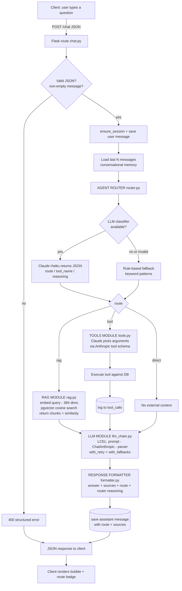

# Architecture Diagram — Smart Shop Assistant

Diagram of this implementation, following the request flow:
`USER QUERY → AGENT ROUTER → RAG / TOOLS → LLM → RESPONSE`.

## 1. Three-tier overview

```
┌──────────────────────────────────────────────────────────────────────┐
│  CLIENT TIER  —  plain HTML + CSS + JavaScript (no framework)         │
│  client/index.html · client/style.css · client/app.js                 │
│                                                                       │
│   chat input · send button · scrollable history · route badge         │
│   trace rail · similarity meters · tool inspector · health pill       │
└───────────────┬──────────────────────────────────────────────────────┘
                │  fetch() — JSON over REST
                │  POST /chat   GET /history   GET /health
                ▼
┌──────────────────────────────────────────────────────────────────────┐
│  SERVER TIER  —  Flask (sole owner of all AI logic and secrets)       │
│  server/app.py + routes/ + services/                                  │
│                                                                       │
│   ┌─────────────┐   ┌──────────┐   ┌───────────┐   ┌──────────────┐   │
│   │ AGENT       │──▶│ RAG      │   │ TOOLS     │   │ LLM MODULE   │   │
│   │ ROUTER      │   │ MODULE   │   │ MODULE    │   │ LangChain    │   │
│   │ router.py   │   │ rag.py   │   │ tools.py  │   │ LCEL chain   │   │
│   │ LLM + rules │   │ pgvector │   │ 2 tools   │   │ llm_chain.py │   │
│   └─────────────┘   └──────────┘   └───────────┘   └──────────────┘   │
│                              ▼                                        │
│                      ┌───────────────────┐                            │
│                      │ RESPONSE FORMATTER│  formatter.py              │
│                      └───────────────────┘                            │
└───────────────┬──────────────────────────────────────────────────────┘
                │  psycopg2 (connection pool)
                ▼
┌──────────────────────────────────────────────────────────────────────┐
│  DATABASE TIER  —  PostgreSQL 16 + pgvector, in Docker                │
│  docker-compose.yml · server/db/schema.sql                            │
│                                                                       │
│   products · product_variants · discount_codes                        │
│   sessions · messages          (conversation history + memory)        │
│   tool_calls                   (tool audit log)                       │
│   kb_documents · kb_chunks     (vector store, VECTOR(384), HNSW)      │
└──────────────────────────────────────────────────────────────────────┘
```

The Anthropic API sits outside all three tiers and is reached over HTTPS by the **server
tier only** — the router calls it to classify, the LLM module calls it to extract tool
arguments and to write the final answer. Neither the client nor the database ever talks
to it.

## 2. Request flow (POST /chat)



## 3. Router decision table

| Customer asks | Route | Component used |
|---|---|---|
| "What is your return policy?" | `rag` | kb_chunks vector search |
| "Do you have the Classic Cotton T-Shirt in size L?" | `tool` | `check_product_availability` |
| "Total for 2 t-shirts with code WELCOME10?" | `tool` | `calculate_order_total` |
| "Hi, what can you help me with?" | `direct` | LLM only |

## 4. Data written on every request

| Table | Written by | Content |
|---|---|---|
| `sessions` | `chat.py` | one row per conversation |
| `messages` | `chat.py` | user message, then assistant message with `route`, `tool_name`, `router_reasoning`, `sources` |
| `tool_calls` | `tools.execute_tool` | tool name, input, output, status, latency |
